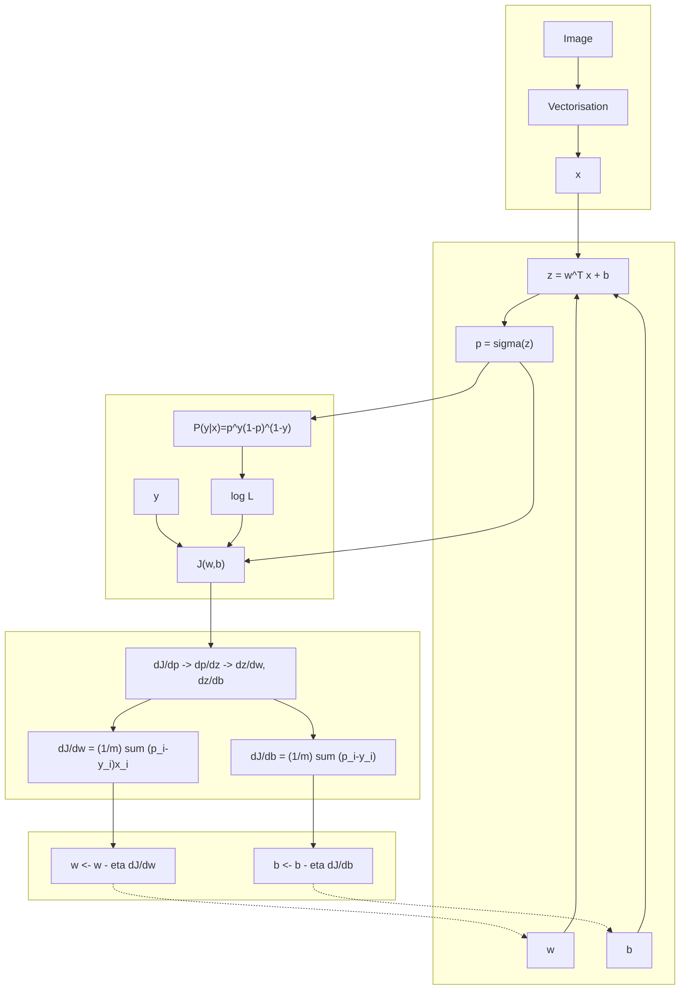

$$
z = w^\top x + b
$$

$$
p = \sigma(z) = \frac{1}{1 + e^{-z}}
$$

$$
p = \mathbb{P}(y=1 \mid x)
$$

$$
\mathbb{P}(y \mid x; w,b) = p^y (1-p)^{1-y}
$$

$$
\mathcal{L}(w,b) = \prod_{i=1}^{m} \mathbb{P}(y_i \mid x_i; w,b)
$$

$$
\log \mathcal{L}(w,b) = \sum_{i=1}^{m} \log \mathbb{P}(y_i \mid x_i; w,b)
$$

$$
J(w,b) = -\frac{1}{m}\sum_{i=1}^{m} \left[y_i \log p_i + (1-y_i)\log(1-p_i)\right]
$$

$$
\frac{\partial J}{\partial p_i}
\quad\to\quad
\frac{\partial p_i}{\partial z_i}
\quad\to\quad
\frac{\partial z_i}{\partial w},\;
\frac{\partial z_i}{\partial b}
$$

$$
\frac{\partial J}{\partial w} = \frac{1}{m}\sum_{i=1}^{m}(p_i - y_i)x_i
$$

$$
\frac{\partial J}{\partial b} = \frac{1}{m}\sum_{i=1}^{m}(p_i - y_i)
$$

$$
w \leftarrow w - \eta \frac{\partial J}{\partial w}
$$

$$
b \leftarrow b - \eta \frac{\partial J}{\partial b}
$$

## Forme vectorielle

$$
X \in \mathbb{R}^{m \times d},
\qquad
w \in \mathbb{R}^{d},
\qquad
b \in \mathbb{R}
$$

$$
z = Xw + b\mathbf{1}
$$

$$
p = \sigma(z)
$$

$$
J(w,b) = -\frac{1}{m}
\left[
y^\top \log p + (1-y)^\top \log(1-p)
\right]
$$

$$
\nabla_w J = \frac{1}{m} X^\top (p-y)
$$

$$
\frac{\partial J}{\partial b} = \frac{1}{m}\mathbf{1}^\top (p-y)
$$

$$
w \leftarrow w - \eta \nabla_w J
$$

$$
b \leftarrow b - \eta \frac{\partial J}{\partial b}
$$
