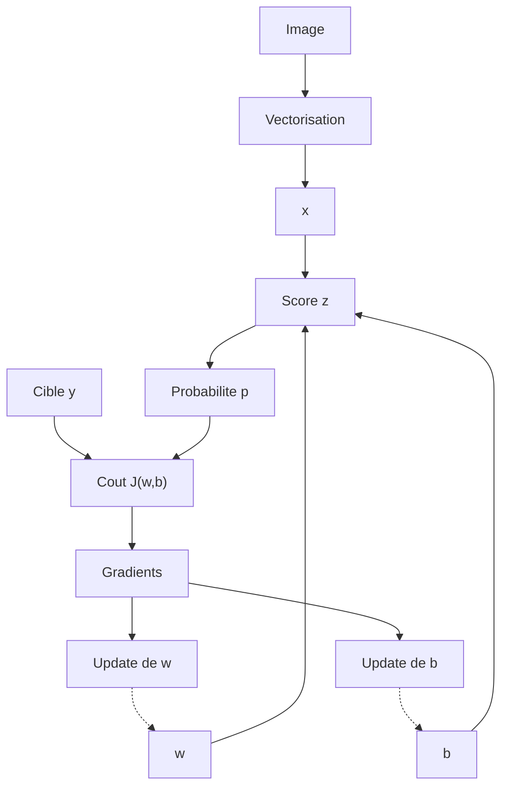
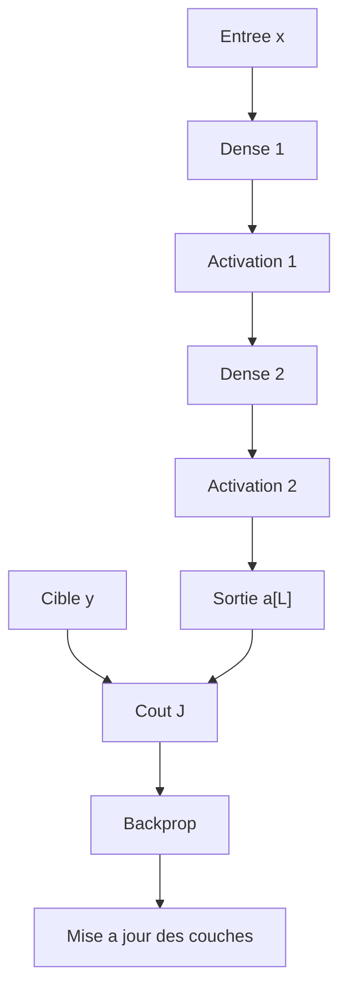

## Neurone unique

$$
z = w^\top x + b
$$

$$
p = \sigma(z) = \frac{1}{1 + e^{-z}}
$$

$$
p = \mathbb{P}(y=1 \mid x)
$$

$$
\mathbb{P}(y \mid x; w,b) = p^y (1-p)^{1-y}
$$

$$
\mathcal{L}(w,b) = \prod_{i=1}^{m} \mathbb{P}(y_i \mid x_i; w,b)
$$

$$
\log \mathcal{L}(w,b) = \sum_{i=1}^{m} \log \mathbb{P}(y_i \mid x_i; w,b)
$$

$$
J(w,b) = -\frac{1}{m}\sum_{i=1}^{m}\left[y_i \log p_i + (1-y_i)\log(1-p_i)\right]
$$

$$
\frac{\partial J}{\partial w} = \frac{1}{m}\sum_{i=1}^{m}(p_i - y_i)x_i
$$

$$
\frac{\partial J}{\partial b} = \frac{1}{m}\sum_{i=1}^{m}(p_i - y_i)
$$

$$
w \leftarrow w - \eta \frac{\partial J}{\partial w}
$$

$$
b \leftarrow b - \eta \frac{\partial J}{\partial b}
$$

## Forme vectorielle

$$
X \in \mathbb{R}^{m \times d},
\qquad
w \in \mathbb{R}^{d},
\qquad
b \in \mathbb{R}
$$

$$
z = Xw + b\mathbf{1}
$$

$$
p = \sigma(z)
$$

$$
J(w,b) = -\frac{1}{m}\left[y^\top \log p + (1-y)^\top \log(1-p)\right]
$$

$$
\nabla_w J = \frac{1}{m}X^\top(p-y)
$$

$$
\frac{\partial J}{\partial b} = \frac{1}{m}\mathbf{1}^\top(p-y)
$$

## Reseau dense

$$
z^{[l]} = W^{[l]} a^{[l-1]} + b^{[l]}
$$

$$
a^{[l]} = g^{[l]}(z^{[l]})
$$

$$
dz^{[L]} = a^{[L]} - y
$$

$$
dW^{[l]} = \frac{1}{m}\,dz^{[l]}(a^{[l-1]})^\top
$$

$$
db^{[l]} = \frac{1}{m}\sum_{i=1}^{m}dz_i^{[l]}
$$

$$
da^{[l-1]} = (W^{[l]})^\top dz^{[l]}
$$

## Forme vectorielle dense

Pour un batch de taille $m$ :

$$
A^{[0]} = X \in \mathbb{R}^{d_0 \times m}
$$

$$
W^{[l]} \in \mathbb{R}^{d_l \times d_{l-1}},
\qquad
b^{[l]} \in \mathbb{R}^{d_l \times 1}
$$

$$
Z^{[l]} = W^{[l]}A^{[l-1]} + b^{[l]}\mathbf{1}^\top
$$

$$
A^{[l]} = g^{[l]}(Z^{[l]})
$$

$$
dZ^{[L]} = A^{[L]} - Y
$$

$$
dW^{[l]} = \frac{1}{m} dZ^{[l]} {A^{[l-1]}}^\top
$$

$$
db^{[l]} = \frac{1}{m} \sum_{j=1}^{m} dZ^{[l]}_{:,j}
$$

$$
dA^{[l-1]} = {W^{[l]}}^\top dZ^{[l]}
$$

Logistic regression correspond au cas $L = 1$.
